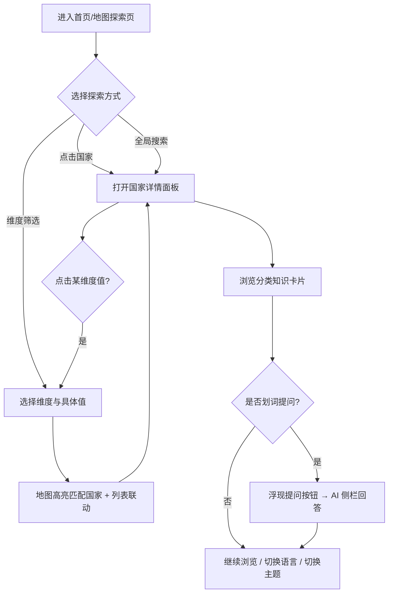

# 产品需求文档（PRD）· 本地化学习网站

## 1. 产品概述

一个面向零基础用户的世界本地化知识学习网站，通过交互式世界地图，帮助小白从零了解各国的货币、语言、宗教、政体、独特假期、首都等本地化知识。
- **解决的问题**：本地化知识分散、门槛高、缺乏直观入口；本产品用「地图 + 分类卡片 + 反向筛选 + AI 划词问答」把知识变得可探索、易理解。
- **目标用户**：本地化/出海从业者、语言与文化学习者、对世界地理文化感兴趣的普通用户。
- **产品价值**：一站式、可视化、双语（可扩展至联合国全语种）、可离线浏览的本地化知识库，兼具学习工具与展示门户价值。

## 2. 核心功能

### 2.1 用户角色

本产品为纯浏览型学习网站，**无需登录、无角色区分**。所有访客拥有相同的浏览、筛选、切换语言/主题、AI 问答能力。

### 2.2 功能模块

1. **首页 / 地图探索页**：交互式世界地图、维度筛选面板、语言切换、主题切换、全局搜索、AI 问答入口。
2. **国家详情面板**：点击国家后弹出的分类知识展示（货币 / 语言 / 宗教 / 政体 / 首都 / 独特假期）。
3. **维度浏览页**：按某一维度（如宗教→佛教）反向筛选，列出所有匹配国家并在地图高亮。
4. **AI 划词问答组件**：选中页面任意文本 → 浮现「提问」按钮 → 侧边栏对话；含用户自有 API Key 设置。
5. **关于 / 数据说明页**：数据来源、免责声明、项目介绍（用于对外展示与 GitHub README 呼应）。

### 2.3 页面功能详情

| 页面名称 | 模块名称 | 功能描述 |
|---------|---------|---------|
| 首页/地图探索页 | 交互式世界地图 | 基于矢量地图渲染 190+ 国家/地区；悬停高亮并显示国名 tooltip；点击国家打开详情面板；支持缩放/平移；当前筛选维度下匹配国家以主题色高亮 |
| 首页/地图探索页 | 维度筛选面板 | 六大维度（货币/语言/宗教/政体/假期/首都）入口；选择某维度下具体值（如宗教→佛教）后，地图仅高亮匹配国家并联动右侧列表 |
| 首页/地图探索页 | 全局搜索 | 输入国家名（中/英）快速定位并打开详情；支持模糊匹配与拼音/英文名 |
| 首页/地图探索页 | 语言切换 | 一键中/英切换，全站文案与按钮即时刷新；架构预留联合国 6 种官方语言扩展位 |
| 首页/地图探索页 | 主题切换 | Light / Dark 模式切换，遵循系统偏好默认值，选择持久化到本地 |
| 国家详情面板 | 分类知识卡片 | 分类展示：🏛️ 首都、💰 货币（名称+符号+代码）、🗣️ 官方语言、🕌 主要宗教、⚖️ 政体、🎉 独特假期；每类独立卡片，避免信息堆叠 |
| 国家详情面板 | 快捷跳转 | 从某维度值（如货币「日元」）一键跳到该维度浏览页，查看同类国家 |
| 维度浏览页 | 反向筛选列表 | 展示所有匹配某维度值的国家卡片（国旗+国名+关键信息），点击进入详情；顶部显示「共 N 个国家」 |
| 维度浏览页 | 地图联动高亮 | 列表与地图双向联动，hover 列表项时地图对应国家高亮 |
| AI 划词问答 | 划词捕获 | 监听文本选区，选中即在选区附近浮现「✨ 向 AI 提问」按钮 |
| AI 划词问答 | 对话侧栏 | 将选中文本作为上下文发给 AI，流式展示回答；支持追问、清空、复制 |
| AI 划词问答 | 设置弹窗 | 用户填写自己的 API Key / 接口地址 / 模型名；仅存本地浏览器，绝不打包进站点、绝不上传第三方 |
| 关于/数据说明页 | 项目与数据说明 | 数据来源、更新时间、免责声明、双语文案、GitHub 链接 |

## 3. 核心流程

**主流程（探索某国家知识）**：用户进入首页 → 浏览世界地图 → 点击某国家 → 右侧/弹层展示该国分类知识卡片 → 对感兴趣内容划词 → 点击「向 AI 提问」→ 侧栏获得解释。

**反向筛选流程**：用户进入首页 → 打开维度筛选面板 → 选择「宗教 → 佛教」→ 地图高亮所有佛教国家 + 右侧列出国家清单 → 点击某国进入详情。

## 4. 用户界面设计

### 4.1 设计风格

整体定位为「精致编辑感 + 地图学探索」气质，专业、克制、有高级感，**刻意避免一眼 AI 味**（不用紫色渐变白底、不用 Inter/Roboto 等通用字体）。

- **主色调**：深墨蓝 / 石板灰为底（Dark 模式主视觉），配暖金铜色作为高亮/强调色；Light 模式为羊皮纸暖白底 + 墨绿点缀，呼应古典地图气质。
- **辅助色**：六大维度各配一个语义色（货币-琥珀金、语言-青蓝、宗教-紫罗兰、政体-赭红、假期-珊瑚橙、首都-翠绿），用于卡片标识与地图分类高亮。
- **字体**：标题用有个性的衬线/展示字体（如 Fraunces / Spectral），正文用清爽人文无衬线（如 Sora / Manrope）；中文标题用思源宋体、正文用思源黑体，中英混排协调。
- **按钮风格**：圆角适中（8–12px）、实心主按钮 + 描边次按钮，hover 有细腻位移与阴影反馈；避免过度立体。
- **布局风格**：地图为视觉主体铺满主区，侧栏/浮层承载详情，卡片化组织知识；适度不对称与留白，营造编辑杂志感。
- **图标/emoji**：维度与卡片大量使用语义 emoji（💰🗣️🕌⚖️🎉🏛️🌍），增强亲和力与识别度，符合「多一些 emoji」的期望。

### 4.2 页面设计概览

| 页面名称 | 模块名称 | UI 元素 |
|---------|---------|---------|
| 首页/地图探索页 | 世界地图 | 全屏矢量地图，深色底+金色描边国家；hover 发光高亮 + 浮动 tooltip；缩放平移带惯性动画 |
| 首页/地图探索页 | 顶部导航栏 | 半透明毛玻璃悬浮条，含 Logo🌍、全局搜索框、语言切换、主题切换、AI 设置入口；滚动时轻微收窄 |
| 首页/地图探索页 | 维度筛选面板 | 左侧可折叠面板，六大维度带语义色圆点与 emoji；选中态高亮，展开二级具体值列表 |
| 国家详情面板 | 分类卡片 | 右侧抽屉/居中弹层，顶部国旗+国名+首都；下方分维度卡片网格，进入时错落淡入动画（staggered） |
| 维度浏览页 | 国家清单 | 卡片网格，国旗缩略图+国名+该维度值；顶部统计条与返回；卡片 hover 抬升 |
| AI 划词问答 | 浮动提问按钮 | 选区上方浮现小胶囊按钮，✨ 图标+微光；点击滑出右侧对话栏 |
| AI 划词问答 | 对话侧栏 | 毛玻璃侧栏，消息气泡区分用户/AI，流式打字效果，底部输入框与设置齿轮 |
| 全站 | 主题切换动效 | Light/Dark 切换时颜色平滑过渡，地图配色同步切换 |

### 4.3 响应式设计

采用**桌面优先**（Desktop-first），地图探索体验以大屏为主；向下适配平板与移动端：移动端地图详情面板改为底部抽屉、维度筛选改为顶部下拉、划词按钮适配触摸长按选区。关键交互均做触摸优化。

### 4.4 国际化与可访问性

- 首发内置**中文 / 英文**双语，所有文案、按钮、维度名、AI 提示均走 i18n 资源表；架构预留联合国 6 种官方语言（中/英/法/俄/西/阿，含阿拉伯语 RTL 预案）扩展位。
- 遵循基础无障碍：键盘可达、focus 可见、色彩对比达标、地图元素带 aria 标签。
