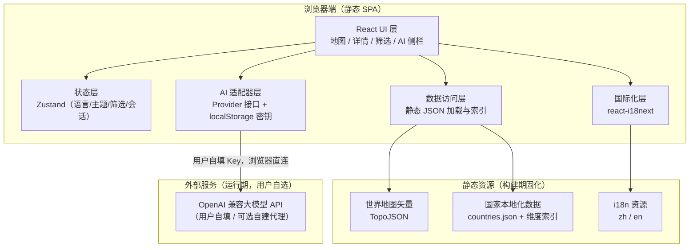
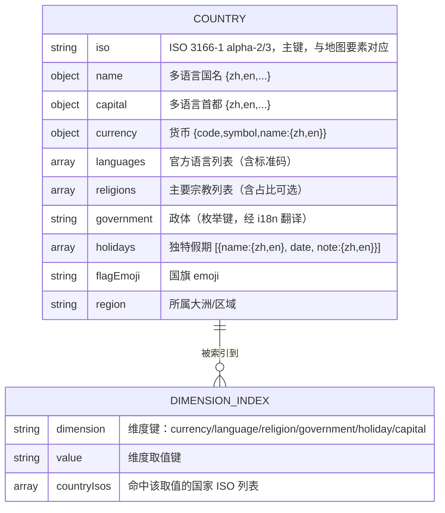

# 技术架构文档 · 本地化学习网站

## 1. 架构设计

本项目为**纯前端静态单页应用（SPA）**，构建产物为静态文件，可直接部署到 GitHub Pages / Vercel / Netlify 等。无自有后端；本地化数据在构建期固化为静态 JSON；AI 问答通过**可插拔适配器**在浏览器端直连用户自填的模型服务，密钥仅存本地，绝不进入构建产物。



## 2. 技术说明

- **前端框架**：React@18 + TypeScript + Vite
- **初始化工具**：vite-init（React + TS 模板）
- **样式方案**：Tailwind CSS@3 + CSS 变量（主题令牌，驱动 light/dark 与维度语义色）
- **状态管理**：Zustand（轻量，管理语言、主题、当前筛选、AI 会话）
- **国际化**：react-i18next + i18next（资源表驱动，预留联合国 6 语种与 RTL）
- **地图渲染**：react-simple-maps + d3-geo（矢量 TopoJSON，支持缩放/平移/高亮），topojson-client 解析
- **动画**：Framer Motion（面板抽屉、卡片错落淡入、主题过渡、划词按钮浮现）
- **AI 接入**：自研 `AIProvider` 适配器接口，默认实现 OpenAI 兼容 `fetch` 流式（SSE）；密钥经 Settings 存入 `localStorage`
- **后端**：无（None）。为密钥安全预留可选 Serverless 代理适配器接口（见 §7）
- **数据库**：无。所有数据为构建期固化的静态 JSON（见 §6），支持离线浏览
- **代码质量**：ESLint + Prettier + TypeScript strict

## 3. 路由定义

采用 HashRouter（利于静态托管无需服务器重写规则）。

| 路由 | 用途 |
|------|------|
| `/` | 首页 / 地图探索页（主入口，含地图、筛选、搜索） |
| `/country/:iso` | 国家详情（可直接分享的深链接，同时以面板形式呈现） |
| `/browse/:dimension/:value` | 维度浏览页（如 `/browse/religion/buddhism`），反向筛选 + 高亮 |
| `/about` | 关于 / 数据说明页 |

## 4. AI 适配器接口定义

浏览器端统一接口，便于「插拔」不同后端；默认走用户自填的 OpenAI 兼容端点。

```typescript
// AI 会话消息
interface ChatMessage {
  role: 'system' | 'user' | 'assistant';
  content: string;
}

// 用户在设置弹窗填写、存于 localStorage 的配置（绝不打包进构建产物）
interface AIProviderConfig {
  baseURL: string;   // 如 https://api.openai.com/v1
  apiKey: string;    // 用户自有密钥，仅存本地浏览器
  model: string;     // 如 gpt-4o-mini
}

// 可插拔适配器接口
interface AIProvider {
  // 流式返回；onToken 逐段回调，便于打字机效果
  streamChat(
    messages: ChatMessage[],
    onToken: (delta: string) => void,
    signal?: AbortSignal
  ): Promise<void>;
}

// 划词问答请求上下文（selection = 用户划选文本，country = 可选当前国家）
interface AskContext {
  selection: string;
  country?: string;
  locale: 'zh' | 'en';
}
```

**默认实现**：`OpenAICompatibleProvider` 使用 `fetch` + `ReadableStream` 解析 SSE，实现流式打字机效果，支持 `AbortController` 取消。

## 5. 密钥安全方案

用户明确要求「部署到线上后别人不会获取到我的 API 密钥」。方案如下：

1. **构建产物零密钥**：代码库与打包结果中**不含任何真实密钥**；`.env` 仅用于本地开发的可选默认值且加入 `.gitignore`，不参与生产构建注入。
2. **默认 BYOK（Bring Your Own Key）**：线上访客在「AI 设置」弹窗填入**自己的**密钥，存于其本人浏览器 `localStorage`，仅用于其浏览器直连模型服务；你的密钥完全不出现在站点中，从根本上杜绝泄露。
3. **可选安全升级（预留接口）**：若你希望用自己的密钥统一提供服务，实现一个 `ProxyProvider`——前端只调用你部署的 Serverless 函数（Vercel/Cloudflare Functions），密钥作为服务端环境变量保存，永不下发到浏览器。此模式下站点仍以静态为主，仅新增一个函数端点。UI 层无需改动，只切换 Provider 实现。

## 6. 数据模型

### 6.1 数据模型定义

数据为静态 JSON，非数据库。核心实体为 `Country`，并派生若干维度倒排索引以支持反向筛选与高亮。



### 6.2 数据来源与构建

- **地图矢量**：world-atlas（TopoJSON，110m 精度）提供国家边界，以 ISO 码与数据表关联。
- **国家数据**：以 REST Countries 等开放数据集为基础（货币/语言/首都/地区/国旗），宗教、政体、独特假期通过公开权威资料整理补全；生成 `public/data/countries.json`。
- **构建期脚本**：`scripts/build-data.ts` 负责抓取/清洗/合并，并生成六大维度的倒排索引 `public/data/index.<dimension>.json`，供反向筛选 O(1) 命中。
- **双语字段**：名称、首都、宗教、政体、假期等含展示文本的字段采用 `{zh, en}` 结构，扩展新语种时追加键即可。
- **数据分批策略**：首批交付覆盖 190+ 国家/地区的核心六维度；宗教占比、更多假期等精细字段可在后续批次持续补全，数据结构已预留。

## 7. 分批实施计划

| 批次 | 范围 | 交付物 |
|------|------|--------|
| 批次一（基座） | 工程初始化、设计系统（主题令牌/字体/暗色）、i18n 框架、静态数据管道、世界地图渲染与交互 | 可浏览、可缩放、可点击高亮的双语地图站点骨架 |
| 批次二（核心知识） | 国家详情分类卡片、维度筛选面板、维度浏览页与地图联动、全局搜索 | 正向探索 + 反向筛选完整闭环 |
| 批次三（AI 与打磨） | 划词捕获、AI 适配器与对话侧栏、设置弹窗（BYOK）、动画细节、响应式适配、关于页 | 划词问答上线，全站体验完善 |
| 批次四（部署与展示） | 生产构建、GitHub Pages/Vercel 部署配置、README 与数据说明 | 线上可访问，具备对外展示物料 |
